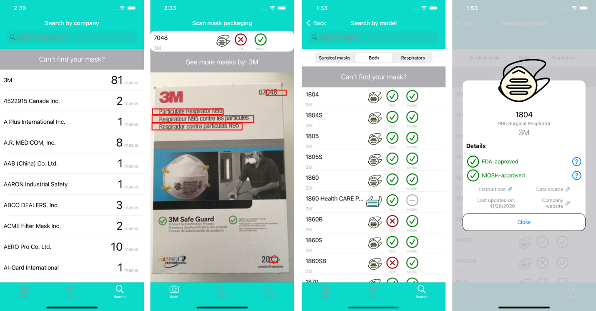

# The Masked Manual iOS App

This application lets you easily search for a face mask's qualifications from federal agencies in the U.S. Both surgical masks and respirators are supported.

See also:
* [The Python backend source](https://github.com/smrfeld/the-masked-manual-python).
* [About website](https://the-masked-manual.herokuapp.com).

## Screenshots

## Developer

### Image recognition

Motivation from [this introduction to the Vision framework on iOS](https://www.appcoda.com/vision-framework-introduction/).